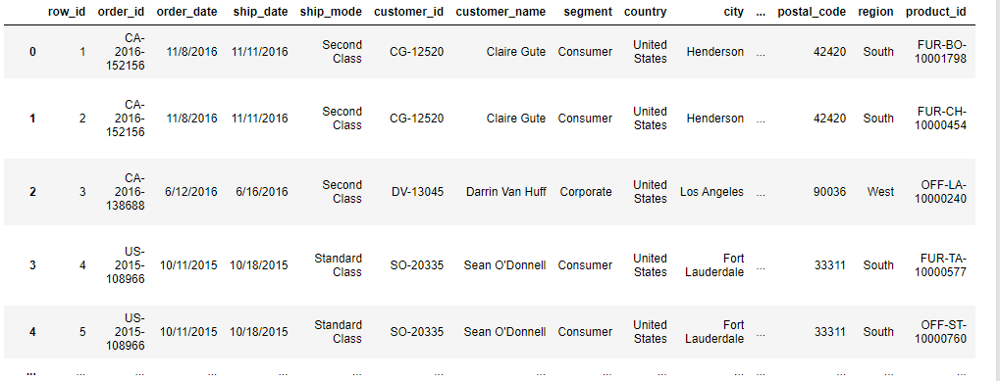

# Super-Store-Products-Analysis
A short and rich insight into what , which,  how and 'so what' data story of Superstore products.

## Introduction
Superstore, a medium-sized store that sells a wide range of products might just need insights into their business beyond the superficial; beyond what their intution can tell them. The goal of this analysis is to glean data-driven insights from the Superstore dataset at hand, and recommend 'so what' steps to take in redefining their sales story. This analysis makes a clear-cut dissection of the trend and pattern that concerns different aspects of the Superstore business. Key metrics including profit, revenue growth, product demand and supply, sales among others were explored and their deductions, captured for conclusions. In summary, here is a string of steps to tell a compelling story to optimize the performance of Superstore analysis.

## Business Questions
1.  What is the profit distribution?
2.  What is the sales distribution?
3.  What is the most ordered category of product?
4.  Which is the mostly ordered subcategory?
5.  How are the products ordered over the years?
6.  What is the relationship between sales, profit, and quantity?
7.  What are the product categories and ship classes used, show the distribution?
8.  What are the most ordered categories of product in each region?
9.  What are the segments of buyers in each region?
10. What are the sub-categories and which category they belong to?
11. How much sales were made in each region?
12. What profit were made in each region?
13. How much sales was made from each category?
14. What profit was made from each category?
15. Which states were characterized with loss (negative profit)?

## Data Preparation

First off, as we are working on Jupyter notebook, the necessary libraries were imported while making sure there is an internet connection.

```python
import pandas as pd
import matplotlib as plt
import seaborn as sb
```
Next, the dataset used for the analysis was loaded onto Jupyter notebook using the **pandas** library. But before this, I'd made sure the dataset is already available in my working directly.

```python
df = pd.read_csv("superstore_cleaned.csv")
```
To have at least have a visual idea of what the dataframe looks like, I called it out.

```python
df
```
And what you have as output is this dataframe of size 9994 rows × 21 columns i.e 9994 instances of record, with 21 variables sprawled across the columns. A sneak peak below:


Next, I checked out the data types of what I've got.
df.dtypes

## Data Cleaning
Next is to roll up our sleeves and make our data less dirty. But first, let's even check if the data is dirty at all. So to that,

1. Check for missing values
```python
df.isnull().sum()
```
Turns out the data contained no missing value.

2. Convert the date column to date data type.
```python
df['order_date'] = pd.to_datetime(df['order_date'])
```
## Analysis and Insights

1. Sales distribution: To explore the distribution of sales across the range of products of Super Store, we firstly estimate the summary statistics of the dataset at hand....
```python
#summary statistics of the sales
df['sales'].describe()
```

and then, we visualize the total sales recorded across the months to butress more on what to know about sales distribution.

```python
month_sales = df.groupby('month')['sales'].sum()
month_sales.plot(marker='o', markersize=8, linestyle='-')
plt.title('Distribution of Sales')
plt.xticks(rotation=45)
plt.show()
```
2. Profit distribution: To explore the distribution of the profit, we apply the same summary statistics step as the above...

```python
#summary statistics of the profit
df['profit'].describe()
```
Furthermore, we make a box plot of the profit distribution.

```python
#boxplot for profit
sns.boxplot(data=df['profit'])
plt.xlabel('profit')
plt.title('Box Plot of Profit')
plt.show()
```

3. Most ordered product category: I grouped the products by product category and visualized the quantity ordered by product category using a bar chart, since we're talking about a categorical variable here.

```python
prod_category = df.groupby('category')['quantity'].sum()
prod_category.plot(kind = 'bar')
plt.xticks(rotation=45)
plt.xlabel(' ')
plt.ylabel('Quantity')
plt.title(' Product Category by Quantity')
plt.show()
```
Alternatively, I attempted to output the most ordered product category directly using the print function.

#grouping the quantities by product category
category_orders = df.groupby('category')['quantity'].sum()

# Find the most ordered category
most_ordered_category = category_orders.idxmax()
print(f"The most ordered product category is: {most_ordered_category}")
**Insight: The most ordered product category is Office Supplies**

4. Most ordered Sub category: Same stroke for different folks. I applied the same steps as above to investigate the most ordered sub category of products.

```
prod_category = df.groupby('sub_category')['quantity'].sum().sort_values(ascending = False)
prod_category.plot(kind = 'bar')
plt.xticks(rotation=45)
plt.xlabel(' ')
plt.ylabel('Quantity')
plt.title(' Product Sub_category by Quantity')
plt.show()
```
Alternatively, I attempted to output the most ordered sub category directly using the **print** function.

#grouping the quantities by subcategory
sub_category_orders = df.groupby('sub_category')['quantity'].sum()

# Find the most ordered category
most_ordered_sub_category = sub_category_orders.idxmax()
print(f"The most ordered product sub category is: {most_ordered_sub_category}")
**Insight: The most ordered product Sub-Category is Binders, followed by paper and furnishings**

5. **How are the products ordered over the years?** To go about this, 
