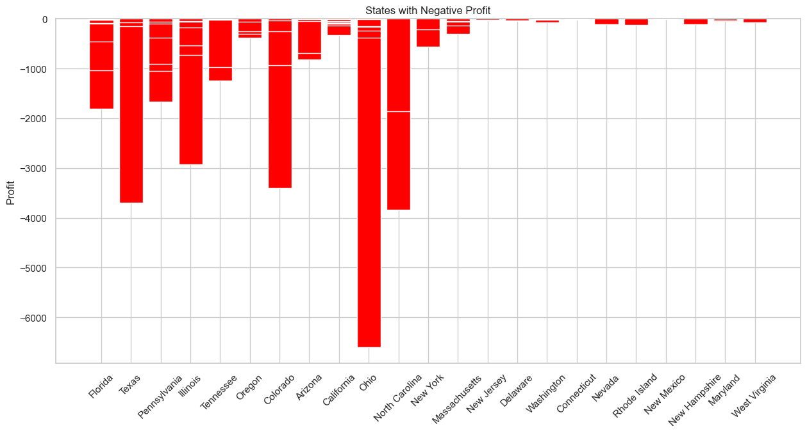

# Super-Store-Products-Analysis
A short and rich data story; into the sales operations of Super Store. And the performance of the products.

## Introduction
Superstore, a medium-sized store that sells a wide range of products might just need insights into their business beyond the superficial; beyond what their intuition can tell them. The goal of this analysis is to glean data-driven insights from the Superstore dataset at hand, and recommend 'so what' steps to take in redefining their sales story. This analysis makes a clear-cut dissection of the trend and pattern that concerns different aspects of the Superstore business. Key metrics including profit, revenue growth, product demand and supply, sales among others were explored and their deductions, captured for conclusions. In summary, here is a string of steps to tell a compelling story to optimize the performance of Superstore analysis.

## Business Questions
1.  What is the profit distribution?
2.  What is the sales distribution?
3.  What is the most ordered category of product?
4.  Which is the mostly ordered subcategory?
5.  How are the products ordered over the years?
6.  What is the relationship between sales, profit, and quantity?
7.  What are the product categories and ship classes used, show the distribution?
8.  What are the most ordered categories of product in each region?
9.  What are the segments of buyers in each region?
10. What are the sub-categories and which category they belong to?
11. How much sales were made in each region?
12. What profit were made in each region?
13. How much sales was made from each category?
14. What profit was made from each category?
15. Which states were characterized with loss (negative profit)?

## Data Preparation

First off, as we are working on Jupyter notebook, the necessary libraries were imported while making sure there is an internet connection.

```python
import pandas as pd
import matplotlib as plt
import seaborn as sb
```
Next, the dataset used for the analysis was loaded onto Jupyter notebook using the **pandas** library. But before this, I'd made sure the dataset is already available in my working directly.

```python
df = pd.read_csv("superstore_cleaned.csv")
```
To have at least have a visual idea of what the dataframe looks like, I called it out.

```python
df
```
And what you have as output is this dataframe of size 9994 rows × 21 columns i.e 9994 instances of record, with 21 variables sprawled across the columns. A sneak peak below:


Next, I checked out the data types of what I've got.
```python
df.dtypes
```


## Data Cleaning
Next is to roll up our sleeves and make our data less dirty. But first, let's even check if the data is dirty at all. So to that,

**1. Check for missing values**
```python
df.isnull().sum()
```
output:

_Turns out the data contained no missing value._

**2. Convert the date column to date data type.**
```python
df['order_date'] = pd.to_datetime(df['order_date'])

## extracting months out of it

df['month'] = df['order_date'].dt.month_name()

## sorting the months

month_order = ['January', 'February', 'March','April', 'May','June', 'July', 
'August', 'September', 'October', 'November', 'December']

df['month'] = pd.Categorical(df['month'], ordered=True, 
categories=month_order)
```
**Doing the same for ship dates**
```python
df['ship_date'] = pd.to_datetime(df['ship_date'])

## extract months from the month data
df['month2'] = df['ship_date'].dt.month_name()

## sorting the months**
month_order = ['January', 'February', 'March','April', 'May','June', 'July', 
'August', 'September', 'October', 'November', 'December']

df['month2'] = pd.Categorical(df['month2'], ordered=True, 
categories=month_order)
```
***Note: ship dates were referenced as df['month2'] as opposed df['month'] so as to create a distinction from the order dates**

**3. Run a basic EDA (Explorative Data Analysis), mainly summary statistics**
```python
df.describe()
```


## Analysis and Insights

**1. Sales distribution:** To explore the distribution of sales across the range of products of Super Store, I first estimated the summary statistics of the dataset at hand...
```python
#summary statistics of the sales
df['sales'].describe()
```


and then, we visualize the total sales recorded across the months to buttress more on what to know about sales distribution.

**Therefore, I created a new column by grouping the sales by month and plotted a line chart using matplotlib**

```python
month_sales = df.groupby('month')['sales'].sum()
month_sales.plot(marker='o', markersize=8, linestyle='-')
plt.title('Distribution of Sales')
plt.xticks(rotation=45)
plt.show()
```


**Insight:** It can be observed from the line graph above that the Super Store had its highest sales in November, followed by September and March. It recorded the least sales in February.


**2. Profit distribution:** To explore the distribution of the profit, we apply the same summary statistics step as the above...

```python
#summary statistics of the profit
df['profit'].describe()
```
Furthermore, I created a new column 'month_profit' by grouping profit by month and plotted a line chart using Matplotlib.

```python
month_profit = df.groupby('month')['profit'].sum()
month_profit.plot(marker='o', markersize=8, linestyle='-')
plt.title('Distribution of Profit')
plt.xticks(rotation=45)
plt.show()
```


**3. Most ordered product category:** I grouped the products by product category. Also, I visualized the quantity ordered based on each product category using a bar chart, since we're talking about a categorical variable here.

```python
prod_category = df.groupby('category')['quantity'].sum()
prod_category.plot(kind = 'bar')
plt.xticks(rotation=45)
plt.xlabel(' ')
plt.ylabel('Quantity')
plt.title(' Product Category by Quantity')
plt.show()
```


Alternatively, I attempted to output the most ordered product category directly using the print function.

```python
#grouping the quantities by product category
category_orders = df.groupby('category')['quantity'].sum()
# Find the most ordered category
most_ordered_category = category_orders.idxmax()
print(f"The most ordered product category is: {most_ordered_category}")
```

**Insight:** The most ordered product category is Office Supplies.

**4. Most ordered Sub-category:** Well, same stroke for different folks. I applied the same steps as above to investigate the most ordered sub-category of products.

```python
prod_category = df.groupby('sub_category')['quantity'].sum().sort_values(ascending = False)
prod_category.plot(kind = 'bar')
plt.xticks(rotation=45)
plt.xlabel(' ')
plt.ylabel('Quantity')
plt.title(' Product Sub_category by Quantity')
plt.show()
```


Alternatively, I attempted to directly output the most ordered subcategory using the **print** function.

```python
#grouping the quantities by subcategory
sub_category_orders = df.groupby('sub_category')['quantity'].sum()
# Find the most ordered category
most_ordered_sub_category = sub_category_orders.idxmax()
print(f"The most ordered product sub category is: {most_ordered_sub_category}")
```

**Insight:** The most ordered product Sub-Category is Binders, followed by paper and furnishings.

**5. How are the products ordered over the year?** Way to go about this, I plotted a line graph over the 12 months in the year to show the quantity ordered over that one-year period.

```python
sns.set_style("whitegrid")
sns.lineplot(x='month', y='quantity', data=df, marker='o', markersize=8, color='g')
plt.xlabel(' ')
plt.ylabel('Quantity ordered')
plt.title('Quantity of products ordered  over time')
plt.xticks(rotation=45)
plt.show()
```


**Insight:** Super Store recorded its highest order in January, August and November. However, business was sloppy in February and September when it recorded its lowest.

6. **What is the relationship between sales, profit and quantity?**
All numerical variables right? I created a scatter plot using seaborn to visualize the relationship between sales and profit infusing the quantities somewhere in between.

```python
fig = plt.figure(figsize=(8, 6))
sns.scatterplot(x='sales', y='profit', size='quantity', hue='quantity', data=df)
plt.title('Relationship between Sales, Profit, and Quantity')
plt.show()
```


**Insight:** Profit increased as sales increased for many products. Interestingly, some products with low sales even incurred negative profit i.e loss. Also, the majority of products sold in high quantities attained one-quarter of the possible sales volume. But two products ordered in relatively lower quantities performed very well in both sales and profit.

7. **Category and shipped class used, show the distribution.** Here, I created a bar chart showing the distribution of ship mode by category. Simply put, for each product category, there are ship categories in which the products came with.

```python
sns.countplot(data=df, x='category',hue='ship_mode')
plt.title('Ship mode distribution by Category')
plt.show() 
```


**Insight:** Generally speaking, most of the products were shipped using standard class followed by second class.

**8. Most ordered category of product in each region:** I simply visualized each category by region. Had to peep into details of what's going on in each location.

```python
sns.countplot(data=store_data, x='region',hue='category')
plt.title('Category distribution by Region')
plt.show()
```


**Insight:** Well, expectedly, office supplies stole the show across all regions. Followed by Furniture, of course.

**9. Segment of buyers in each Region:** A little similar to the above right? Now for each region, I am interested in the segments of buyers instead not categories.

```python
sns.countplot(data=df, x='region',hue='segment')
plt.title('Buyers segment by Region')
plt.show()
```


**Insight:** Across all regions, Consumer has the highest stake in among all buyer segments, followed by Corporate folks and finally, Home office folks.

10. **Sub-categories and which category they belong to:** Now we've seen many appearances of the product categories. Perhaps we visualize their respective sub-categories members too.

```python
sns.catplot(data=df, x='category', hue='sub_category', kind='count', height=6, aspect=1.5)
plt.title("Distribution of sub-category by category")
plt.show()
```


**Insight:** The Office Supplies has the highest range of subcategories, totalling 9. Furthermore, we have got both Furniture and Technology have only four sub categories each. Generally speaking, art pieces and furnishings sold the most.

11.  **Sales made in each region:** So I started by displaying the hard figures of the sales by each region.

```python
#grouping the sales by each region
region_sales = df.groupby('region')['sales'].sum()
print(f"The sales of each region is: {region_sales}")
```

Next, I visualized the figures in a befitting viz:
```python
region_sales = df.groupby('region')['sales'].sum()
region_sales.plot(kind = 'bar')
plt.title('Distribution of Sales across Regions')
plt.xlabel(' ')
plt.xticks(rotation=45)
plt.show()
```


**Insight:** West had the highest sale across all regions, followed by the East.

12. **Profit made in each region:** You'd agree with me that this is quite similar a metric as the above. With the only chip off the block being the profit. So first, we group the profit by region and display the figures:

```python
#grouping the sales by each region
region_profit = df.groupby('region')['profit'].sum()
print(f"The sales of each region is: {region_profit}")
```
Next, I visualized the figures in a befitting viz using seaborn:
```python
plt.figure(figsize=(15, 10))
sb.barplot(data=df, x='region', y='profit', errwidth=False)
plt.title('profit by region')
plt.show()
```

**Insight: West region recorded the highest profit followed closely by the East region. The region with the least profit is the Central region**

**13. Sales made from each category:** I created a new column named category sales, displayed the figures and visualized it.

```python
#grouping the sales by each region
category_sales = df.groupby('category')['sales'].sum()
print(f"The sales of each region is: {category_sales}")
```
Now the vizs
```python
plt.figure(figsize=(15, 10))
sb.barplot(data=df, x='category', y='sales', errwidth=False)
plt.title('sales by category')
plt.show()
```


**Insight:** The Technology category recorded the highest sales followed closely by the Furniture category.

**14.Profit made from each category:** I output the hard figures and thereafter visualized the results.
```python
#grouping the profit by each region
category_profit = df.groupby('category')['profit'].sum()
print(f"The profit made in each category is: {category_profit}")
```
Now the viz:
```python
cat_profit = df.groupby('category')['profit'].sum()
cat_profit.plot(kind = 'bar')
plt.title('Distribution of Profit across Product Category')
plt.xlabel(' ')
plt.xticks(rotation=45)
plt.show()
```


**Insight:**  The Technology category generated the most profit followed closely by the office supplies category.

**15. States with loss (negative profit):** Were you expecting good business across all the states? Well, I was too. Only that Super Store has not hacked the game to that level. So here are the Ls and their magnitudes. :(

To expose the lagging states, I created a new column, store_negative_profit and output the states with negative losses

```python
# create a new dataframe for negative profit
store_negative_profit = df[df['profit'] < 0]
​fig = plt.figure(figsize=(15,10))
#create a bar chart using Matplotlib
plt.bar(store_negative_profit['state'], store_negative_profit['profit'], color='red')
plt.xlabel(' ')
plt.ylabel('Profit')
plt.title('States with Negative Profit')
plt.xticks(rotation=45)
plt.show()
```


**Insight:** The state of Ohio recorded the least profit followed closely by North Carolina and Texas.

## Recommendation
1. Considering the company's peak sales and profits in November and December, it is recommended that the company implement targeted marketing campaigns and promotions during these months to maximize revenue.

3. To enhance performance in January, the company should explore strategies to maintain the positive sales momentum from the holiday season into the new year.

5. Given the popularity of "Office Supplies" as the most ordered category and "Binders" and "Paper" as the most ordered subcategories, the company should consider diversifying the product range within these categories to leverage their high demand.

6. The company should investigate and address the factors contributing to negative profits on large orders. Implementing cost-saving measures or pricing adjustments can help mitigate such losses.

7. Exploring opportunities for optimizing shipping costs and delivery times can enhance customer satisfaction and potentially lead to increased sales.

8. As the West region consistently demonstrates the highest sales and profit, allocating additional resources and intensifying marketing efforts in this region can further capitalize on its potential.

9. Analyzing the buying behavior of consumer and corporate segments can help the company tailor marketing strategies and product offerings to their distinct needs and preferences.
